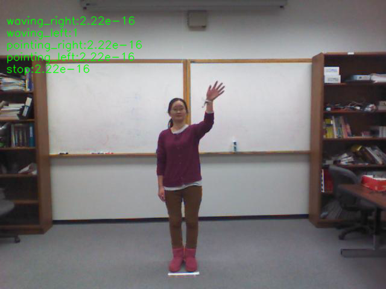

# Gesture recognition on human pose features of single images
homer_gestrec classifies five basic gesture types using [OpenPose](https://github.com/CMU-Perceptual-Computing-Lab/openpose). 

|  Gesture Id         |  Gesture class   | Description
|--|------------------|----------------------------
|1 | waving_right     |  Waving with right hand
|2 | waving_left      |  Waving with left hand 
|3 | pointing_right   |  Pointing with right hand
|4 | pointing_left    |  Pointing with left hand
|5 | stop             |  Prohibition sign

## Usage

### Load pre-trained models
Load pre-trained models
`./load_models.sh`

### Predict gesture using trained-models

### Train your own models
`python ....`
